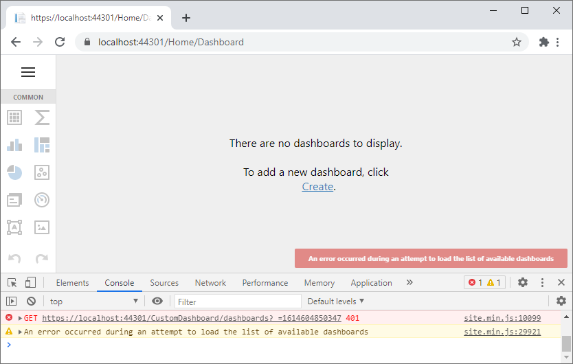

# ASP.NET Core Dashboard - How to implement JWT authentication

This example shows how to implement authentication based on [JWT](https://developer.okta.com/blog/2018/03/23/token-authentication-aspnetcore-complete-guide).

In the example, the [AccountController](CS/Controllers/AccountController.cs) class is used to generate JWT tokens for the predefined set of users. Once the token is generated, the app saves it to [sessionStorage](https://www.w3schools.com/jsref/prop_win_sessionstorage.asp) when a user is on the [Login](CS/Views/Home/Login.cshtml) view.

The [Dashboard](CS/Views/Home/Dashboard.cshtml) view uses the [AjaxRemoteService.beforeSend](https://docs.devexpress.com/Dashboard/js-DevExpress.Dashboard.AjaxRemoteService?p=netframework#js_devexpress_dashboard_ajaxremoteservice_beforesend) callback function to pass this token to the [CustomDashboardController](CS/Controllers/CustomDashboardController.cs):

```js
const tokenKey = "accessToken";
function onBeforeRender(sender) {
    var dashboardControl = sender;
    const token = sessionStorage.getItem(tokenKey);
    dashboardControl.remoteService.beforeSend = function (jqXHR, settings) {
        jqXHR.setRequestHeader("Authorization", "Bearer " + token);
    }
}
```

You need to mark the [CustomDashboardController](CS/Controllers/CustomDashboardController.cs) controller with the [Authorize](https://docs.microsoft.com/en-us/dotnet/api/microsoft.aspnetcore.authorization.authorizeattribute?view=aspnetcore-3.1) attribute):

```cs
using DevExpress.DashboardAspNetCore;
using DevExpress.DashboardWeb;
using Microsoft.AspNetCore.Authorization;

namespace ASPNETCore30Dashboard.Controllers {
    [Authorize]
    public class CustomDashboardController : DashboardController {
        public CustomDashboardController(DashboardConfigurator configurator)
            : base(configurator) {

        }
    }
}
```

Main JWT and Dashboard configurations are defined in the [Startup.cs](CS/Startup.cs) file. You can use the approach from the following article to access the current user name (`AppContext.Current.User.Identity.Name`) in code: [A better approach to use HttpContext outside a Controller in .Net Core 2.1 - Quick Dev Notes](https://www.quickdevnotes.com/better-approach-to-use-httpcontext-outside-a-controller-in-net-core-2-1/). 

You can apply this approach for the [DashboardConfigurator](https://docs.devexpress.com/Dashboard/DevExpress.DashboardWeb.DashboardConfigurator?p=netframework) events and Dashboard storages. Below you can find thecorresponding code parts:

```cs
// Startup.cs:
configurator.CustomParameters += (s, e) => {
    e.Parameters.Add(new DashboardParameter("LoggedUser", typeof(string), AppContext.Current.User.Identity.Name));
};
...
// CustomDashboardStorage.cs:
protected override XDocument LoadDashboard(string dashboardID) {
    Debug.WriteLine(AppContext.Current.User.Identity.Name);
    return base.LoadDashboard(dashboardID);
}
```

If you open the [Dashboard](CS/Views/Home/Dashboard.cshtml) view without logging in, you see the `401 (Unauthorized)` error and the Web Dashboard control cannot load dashboards:



## See Also

- [T590909 - Web Dashboard - How to load dashboards based on user roles](https://supportcenter.devexpress.com/ticket/details/t590909/web-dashboard-how-to-load-dashboards-based-on-user-roles)
- [T954359 - MVC Dashboard - How to implement multi-tenant Dashboard architecture](https://supportcenter.devexpress.com/ticket/details/t954359/mvc-dashboard-how-to-implement-multi-tenant-dashboard-architecture)
